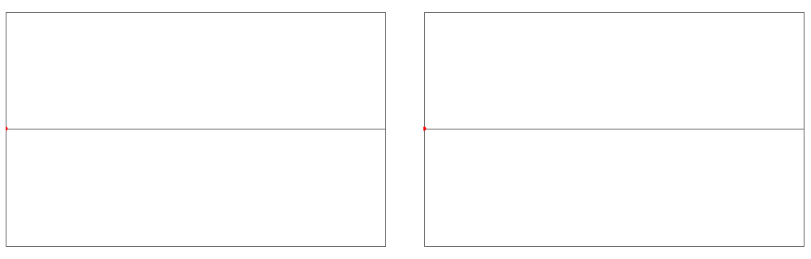

# Interleaver

*Interleaver* is a utility algorithm for progressive rendering of 1D and 2D data for faster visual results and evaluation. Instead of rendering data sequentially in your code, you can use *Interleaver* to get a list of data points to render: first for the edges, then the center point, then the points between those and so forth, always "filling in" the gaps. In 2D, it performs a recursive binary masking, overlaid on top of the image. This effectively gives you a one-by-one rendering order for coarse-to-fine rendering of your data.

While "progressive rendering" is nothing new in 2D images, it's typically implemented in terms of whole chunks and not individual data points. In 1D I haven't found anything quite similar.

I originally developed this for smarter rendering of my [Wikipedia animations](https://en.wikipedia.org/wiki/User:LucasVB/Gallery), where I'd use *Interleaver* to get the frame-rendering order. I would be able to see the first frame, then the last frame, then the middle frame, and as the rendering progressed I could quickly get a glimpse of the whole thing and how the animation was turning out way before the full animation was rendered. This allowed me to spot mistakes and errors earlier on, and abort the rendering process.

This was inspired by traditional animation, in which [key frames](https://en.wikipedia.org/wiki/Key_frame) are drawn first to get a rough idea of the animation. The animator then goes back drawing (or [inbetweening](https://en.wikipedia.org/wiki/Inbetweening)) the remaining frames. Eventually, I realized this function can be really useful in all sorts of other scenarios, like computer simulations that can be rendered in parallel. We can see the results of our work *much* faster by using this function.

There are no size restrictions for either the 1D or 2D functions.

# Examples

Below are simple examples of how much faster you can undertand pictures by virtue of *Interleaver*'s data order.

In 1D, we can understand this function's shape with about a quarter of the final data.

In 2D, the partial data in *Interleaver* order is very helpful even without any sort of interpolation of missing data. Also, notice that *Interleaver* fills datapoints in a *quincunx* pattern, which results in much more useful visual information than a simple binary tree.

(The algorithms could probably be greatly simplified with some clever math magic, but I haven't looked into it much. I've just been using the old function that has done the trick all these years.)
